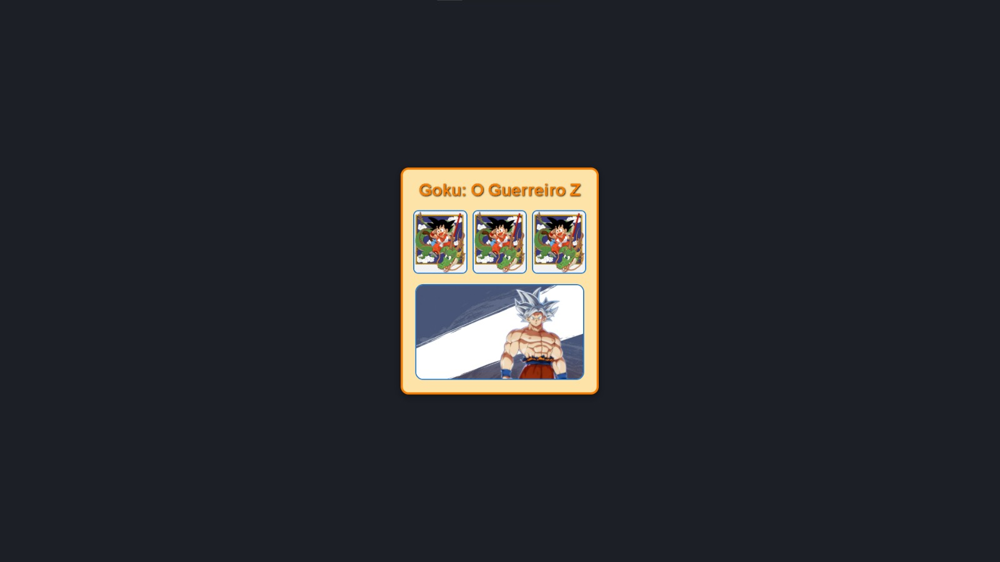

# Goku Web Page 🚀

Este é um simples projeto de aprendizado para testar como funciona o Docker e a contêinerização de uma aplicação web. O projeto exibe uma página com imagens do Goku, utilizando um layout simples com um fundo temático.



## Como Executar o Projeto

1. **Clone este repositório:**
    ```bash
    git clone https://github.com/Vitor-DBelo/PagDBComDocker.git
    ```

2. **Construa a imagem Docker:**
    No terminal, dentro do diretório do projeto, execute o comando abaixo para construir a imagem Docker:
    ```bash
    docker build -t goku-web-page .
    ```

3. **Execute o contêiner Docker:**
    Após a imagem ser construída, execute o contêiner com o seguinte comando:
    ```bash
    docker run -p 8080:80 goku-web-page
    ```

4. **Acesse a página no seu navegador:**
    Abra o navegador e acesse `http://localhost:8080` para visualizar a página com o tema do Goku.

## Como Funciona

Este projeto utiliza o **Nginx** em um contêiner Docker para servir uma página HTML simples que exibe imagens do personagem Goku. O objetivo deste projeto é proporcionar uma introdução básica ao Docker e à contêinerização de aplicações web.

### Arquivos Principais:

- `index.html`: Arquivo HTML que contém a estrutura da página, com imagens e estilo básico.
- `Dockerfile`: Define como a imagem Docker será construída, utilizando o Nginx para servir o HTML.
  
### Imagem de Interface

A interface é simples e apresenta imagens do Goku. O arquivo de imagem principal (`imagen_interface.jpeg`) pode ser adicionado conforme necessário para personalizar a página.

## Conclusão

Este projeto é um exemplo simples para mostrar como funciona a criação e execução de aplicações em contêineres Docker. É perfeito para quem está começando a aprender sobre Docker e contêinerização de aplicações web.

---

Feito com 💻 e 🚀 para fins de aprendizado.
